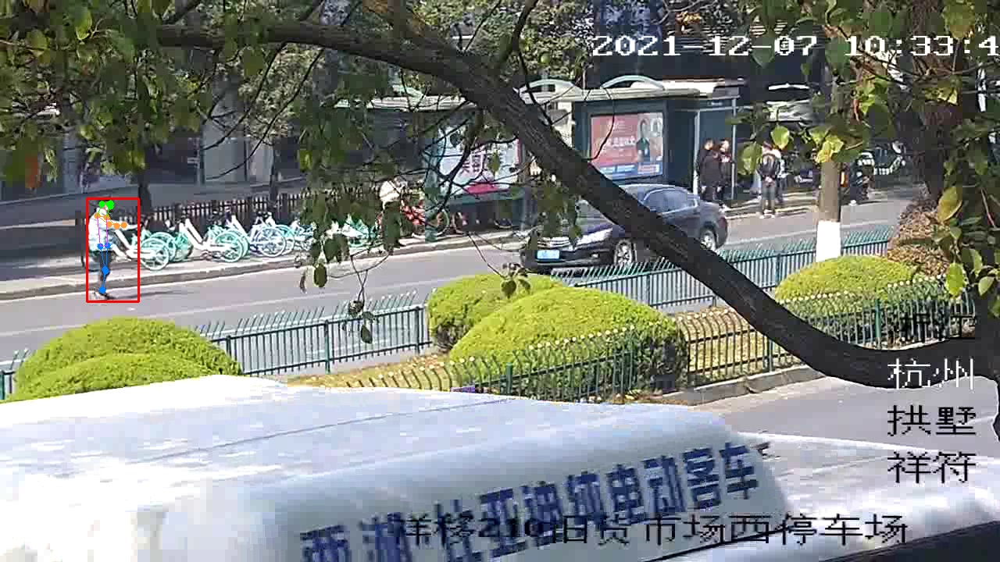

## pose_det API

## 一、接口说明

该接口为人体骨架关键点检测接口
目前仅支持结构：BACKBONE:HRNET + HEAD:TopdownHeatmapSimpleHead

代码由官方代码重构而得，
官方代码见：https://github.com/open-mmlab/mmpose.git
具体参考：https://github.com/open-mmlab/mmpose/blob/master/demo/top_down_img_demo_with_mmdet.py

人体骨架关键点检测结果样例见：


## 二、环境配置

**本仓库依赖mmcv-full、mmpose、其余依赖见：requirements.txt**

本仓库基于cuda10.2

首先用pip install -r requirements.txt安装其他依赖

然后安装mmcv，mmcv详细安装见：https://github.com/open-mmlab/mmcv

本仓库基于cuda10.2，以及pytorch1.8.0，所以安装mmcv-full使用的命令为：pip install mmcv-full -f https://download.openmmlab.com/mmcv/dist/cu102/torch1.8.0/index.html 最后安装的mmcv-full版本为1.4.1

最后安装mmpose，mmpose详细安装见：https://github.com/open-mmlab/mmpose

## 三、参数说明

##### **pose_det.src.pose_detecter.pose_detecter**

人体骨架关键点检测类

类构建参数：

1. model_cfg: str, 模型结构参数路径，参数在“./pose_det/src/configs”中，目前支持仅hrnet_w32_coco_256x192.py

2. model_weights: str, 模型权重路径，可在44服务器，路径“./pose_det/src/weights”中获取，目前只支持hrnet_w32_coco_256x192.py结构对应的权重参数：hrnet_w32_coco_256x192-c78dce93_20200708.pth，该权重参数是hrnet_w32_coco_256x192.py结构模型在COCO数据集上训练的权重

3. device: torch.device object, 推理的device

###### pose_det.src.pose_detecter.pose_detecter.inference

单张图片人体骨架关键点检测方法

1. 输入参数：<br>
   img: ndarray, shape：(H, W, 3), 通道顺序：RGB<br>
   bboxs: torch.float32, (N, 5), (:, :4)分别为bbox左上角右下角xy坐标, (:, 4)代表置信度

2. 输出结果：<br>
   result: 长度为len(bboxs)的dict,<br>
       key: 为bbox的id(从0开始计算), int<br>
       value: 为对应bbox id的关键点结果和bbox, dict<br>
        其中包含两个key,<br>
           “keypoints”, ndarray, shape=(17, 3), (:,:2)为17个关键点的xy坐标, (:, 2)为17个关键点坐标对应的置信度<br>
           “bbox”, ndarray, shape=(5,), (:4,)为左上右下xy坐标值, (4,)为对应bbox置信度<br>

## 四、使用样例

**you can use it as submodule**

在自己的项目目录下，git submodule add  https://github.com/ahaqu01/pose_det.git

便会在项目目录下下载到pose_det 相关代码

下载完成后，便可在自己项目中使用pose_det API，**使用样例**如下：

```python
import cv2
import torch
from yolov5.src.detecter import Detecter
from pose_det.src.pose_detecter import pose_detecter

device = torch.device('cuda:0' if torch.cuda.is_available() else 'cpu')
psdet = pose_detecter(model_cfg="./pose_det/src/configs/hrnet_w32_coco_256x192.py",
                      model_weights="./pose_det/src/weights/hrnet_w32_coco_256x192-c78dce93_20200708.pth",
                      device=device)
# frame_rgb: ndarray, shape：(H, W, 3), 通道顺序：RGB
# humdet_pred: torch.float32, (N, 5), (:, :4)分别为bbox左上角右下角xy坐标, (:, 4)代表置信度
result = psdet.inference(frame_rgb, bboxs=humdet_pred)

```
